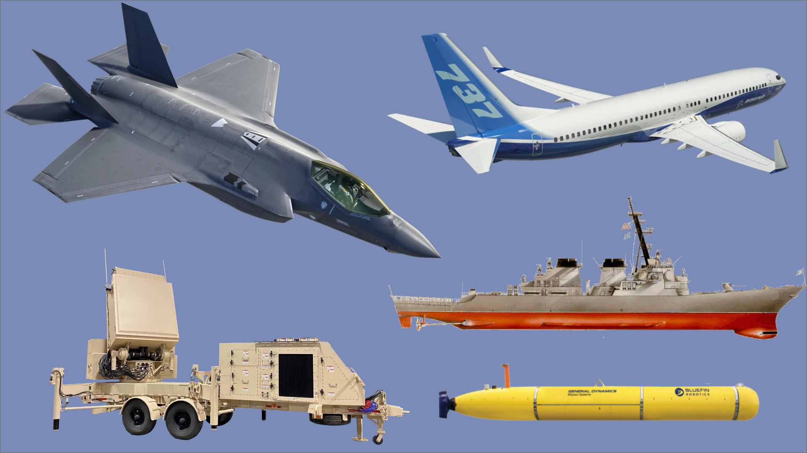

# Black Hawks, tanks and submarines, oh my!

 [A compilation of defense contractor products. Image created by Ela Jalil.]{style="font-size: 12px;"}

### Defense spending grew under Biden, but top defense contractors received less money.

## [What's going on?]{.underline}

On the campaign trail for his first term in office, president Donald Trump promised that he was going to greatly increase [defense spending](https://www.nbcnews.com/politics/2016-election/trump-calls-increased-defense-spending-more-military-might-n644056). Although there was some expectation that Joe Biden would change course, he stated that he would not decrease spending during his [time in office](https://www.theguardian.com/us-news/2022/apr/03/biden-record-defense-budget-progressive-spending-priorities). 

Biden kept his promise, increasing the Department of Defense spending by 5.4% between 2020 and 2024.

<iframe src="https://flo.uri.sh/visualisation/29243692/embed" title="Interactive or visual content" class="flourish-embed-iframe" frameborder="0" scrolling="no" style="width:100%;height:300px;" sandbox="allow-same-origin allow-forms allow-scripts allow-downloads allow-popups allow-popups-to-escape-sandbox allow-top-navigation-by-user-activation">

</iframe>

Biden increased DOD spending across 78.3% of U.S. states and territories. The state that received the greatest cut during his time in office was Texas.

<iframe title="Department of Defense spending by state in 2020 and 2024" aria-label="Choropleth map" id="datawrapper-chart-rzM1T" src="https://datawrapper.dwcdn.net/rzM1T/13/" scrolling="no" frameborder="0" style="width: 0; min-width: 100% !important; border: none;" height data-external="1">

</iframe>

```{=html}
<script type="text/javascript">(function(){function e(){window.addEventListener(`message`,function(e){if(e.data[`datawrapper-height`]!==void 0){var t=document.querySelectorAll(`iframe`);for(var n in e.data[`datawrapper-height`])for(var r=0,i;i=t[r];r++)if(i.contentWindow===e.source){var a=e.data[`datawrapper-height`][n]+`px`;i.style.height=a}}})}e()})();</script>
```
But under the Biden administration, Lockheed Martin — the defense contractor that was awarded the most money from the government in 2020 and 2024 —  received less than half of what it was awarded under the Trump administration. 

```{r include=FALSE}
library(httr)
library(jsonlite)
library(dplyr)
```

```{r}
#| code-fold: true
#| code-summary: "Code"


body <- list(
  filters = list(
    time_period = list(
      list(
        start_date = "2019-10-01",
        end_date   = "2020-09-30"
      )
    ),
    agencies = list(
      list(
        type = "awarding",
        tier = "toptier",
        name = "Department of Defense"
      )
    )
  ),
  limit = 10,
  page = 1
)

response <- POST(
  "https://api.usaspending.gov/api/v2/search/spending_by_category/recipient/",
  body = body,
  encode = "json"
)

data <- fromJSON(
  content(response, "text", encoding = "UTF-8"),
  flatten = TRUE
)

top10_2020 <- data$results %>%
  select(
    contractor = name,
    uei,
    obligations = amount
  ) %>%
  arrange(desc(obligations)) %>% 
  rename(obligations_2020 = obligations)
body <- list(
  filters = list(
    time_period = list(
      list(
        start_date = "2023-10-01",
        end_date   = "2024-09-30"
      )
    ),
    agencies = list(
      list(
        type = "awarding",
        tier = "toptier",
        name = "Department of Defense"
      )
    )
  ),
  limit = 10,
  page = 1
)

response <- POST(
  "https://api.usaspending.gov/api/v2/search/spending_by_category/recipient/",
  body = body,
  encode = "json"
)

data <- fromJSON(
  content(response, "text", encoding = "UTF-8"),
  flatten = TRUE
)

top10_2024 <- data$results %>%
  select(
    contractor = name,
    uei,
    obligations = amount
  ) %>%
  arrange(desc(obligations)) %>% 
  rename(obligations_2024 = obligations)
```

```{r}
##| code-fold: true
##| code-summary: "Code"
updated_defense <- top10_2020 %>%
  inner_join(top10_2024, by="uei") %>% 
  select(-contractor.y) %>% 
  select(-uei) %>% 
  mutate(spending_difference = (obligations_2020-obligations_2024)) %>% 
  rename(contractor = contractor.x)
write.csv(updated_defense,"~/Downloads/updated_defense.csv", row.names = FALSE)
```

```{r echo=FALSE}
library(gt)
updated_defense %>%
  head() %>%
  gt() %>%
  tab_header(title = "Top defense contractors between 2020 and 2024")
```

<iframe title="Difference in spending for top defense contractors" aria-label="Grouped Bars" id="datawrapper-chart-ZOu9W" src="https://datawrapper.dwcdn.net/ZOu9W/1/" scrolling="no" frameborder="0" style="width: 0; min-width: 100% !important; border: none;" height data-external="1">

</iframe>

```{=html}
<script type="text/javascript">(function(){function e(){window.addEventListener(`message`,function(e){if(e.data[`datawrapper-height`]!==void 0){var t=document.querySelectorAll(`iframe`);for(var n in e.data[`datawrapper-height`])for(var r=0,i;i=t[r];r++)if(i.contentWindow===e.source){var a=e.data[`datawrapper-height`][n]+`px`;i.style.height=a}}})}e()})();</script>
```
## Company Descriptions

+------------------------------------+---------------------------------+------------------------------------------+--------------------------------------------------+
| Company                            | Business Segments               | Profit(per most recent quarterly report) | Key Products                                     |
+====================================+=================================+=========================================:+==================================================+
| **Lockheed Martin Corporation**    | -   Aeronautics                 | \$5.017 billion                          | -   Military aircraft including the F-35 program |
|                                    |                                 |                                          |                                                  |
|                                    | -   Missiles and Fire Control   |                                          | -   Missile defense systems and strike weapons   |
|                                    |                                 |                                          |                                                  |
|                                    | -   Rotary and Mission Systems  |                                          | -   Helicopters (Black Hawks) and radar systems  |
|                                    |                                 |                                          |                                                  |
|                                    | -   Space                       |                                          |                                                  |
+------------------------------------+---------------------------------+------------------------------------------+--------------------------------------------------+
| **\*Electric Boat Corporation**    | -   Aerospace                   | \$4.21 billion                           | -   Business jets (Gulfstreams)                  |
|                                    |                                 |                                          |                                                  |
|                                    | -   Marine Systems              |                                          | -   Nuclear powered submarines                   |
|                                    |                                 |                                          |                                                  |
|                                    | -   Combat Systems              |                                          | -   Combat vehicles                              |
|                                    |                                 |                                          |                                                  |
|                                    | -   Technologies                |                                          |                                                  |
+------------------------------------+---------------------------------+------------------------------------------+--------------------------------------------------+
| **The Boeing Company**             | -   Commercial Airplanes        | \$2.238 billion                          | -   Commercial aircrafts (777)                   |
|                                    |                                 |                                          |                                                  |
|                                    | -   Defense, Space & Security   |                                          | -   Military aircraft and weapons systems        |
|                                    |                                 |                                          |                                                  |
|                                    | -   Global Services             |                                          | -   Intellectual property                        |
+------------------------------------+---------------------------------+------------------------------------------+--------------------------------------------------+
| **RTX Corporation**                | -   Collins Aerospace (Collins) | \$7.069 billion                          | -   Commercial, business and military aircraft   |
|                                    |                                 |                                          |                                                  |
|                                    | -    Pratt & Whitney            |                                          | -   Air and missile defense                      |
|                                    |                                 |                                          |                                                  |
|                                    | -   Raytheon                    |                                          | -   Radar systems                                |
+------------------------------------+---------------------------------+------------------------------------------+--------------------------------------------------+
| **Humana Government Business Inc** | -   Insurance                   | \$1.188 billion                          | -   Health care services                         |
|                                    |                                 |                                          |                                                  |
|                                    | -   CenterWell                  |                                          |                                                  |
+------------------------------------+---------------------------------+------------------------------------------+--------------------------------------------------+

\*The 10-K used for the Electric Boat Company is from General Dynamics Corporation.

This story will analyze the difference in defense contract spending by the first term Trump administration and the Biden administration. In this pitch I will identify the ten defense contractors that received the most money from each administration, and analyze the differences between the two. I will then look at the distribution of obligations across the country, and compare this to the overall Department of Defense spending. I will also look closer into the products that the defense companies are making.

## Modern day Relevance

In April 2026, the AP reported that Trump wanted to increase defense spending to \$1.5 trillion, around a 44% increase. This expansion is at the expense at domestic programs, which will experience a 10% cut. Trump has justified this spending due to the continued conflict with Iran, and need for security against global threats. To understand this, it is important to understand how defense spending has been ramping up since Trump's first time in office, and something that was continued by Biden. This indicates bipartisan support for defense spending, a preference that would be interesting to compare to the broader American population.

## Company analysis

The company that I am mainly focusing on in this project is Lockheed Martin. It has 123,000 employees as of December 31, 2025. **describe 2025 net income and revenues** The four business segments that Lockheed Martin works in is aeronautics, missiles and fire control, rotary and mission systems and space. The CEO is named Jim Taiclet.

{fig-align="center" width="216"}

\[[Taiclet was named CEO in 2020. (Lockheed Martin)]{style="font-size: 12px;"}\]

### Target Audience

My audience would be Americans that care about how the government is allocating defense spending.

## People I would interview

1.  Ryan Bradel - He is a partner at the Ward and Berry, a D.C law firm that specializes in government contracting. He's represented multiple defense contracting, and so he would be able to give an expert opinion on how to navigate the information.
2.  Reach out to press contacts for the defense contracting that I am covering so that they have a chance for comment on the amount of government spending they receive.
3.  I would reach out to the Department of War, and Pete Hegseth's team for comment on how the department allocates spending towards contractors.

## Potential impact

Because I am going to look at where the funding for the defense contractors are going to be allocated by state and county, I will be able to see the impact that defense contractors have in local communities. Beyond the bipartisan separation on defense spending, it would also be interesting to see if there would be any impacts on jobs when defense spending is cut.

## Interesting aspects of the story

Although I have had limited time with the data I pulled, I was already able to see the differences in spending between the Trump and Biden administration. I think that the fact that multiple child corporations of Lockheed Martin show up in the top ten highest obligations indicates that there are only a couple of defense contractors that hold a large amount of power in the US. I also thought it was interesting that one of the only contractors that received more money under the Biden administration was the organization dedicated to defense healthcare. This shows a difference in priorities between the two administrations.

## Previous coverage

I noticed that a lot of the previous coverage of the story compared the similarity in spending between the final year of the Trump administration and the first year of the Biden administration. I think that it would be also interesting to cover the difference between 2020 and 2021, but also 2021 and 2024 to see if Biden evolved on his defense spending throughout his tenure in office.

## Previous aspects of the pitch

### Visuals

I am planning on looking at each defense company over each year of the presidency, so I will be doing a line chart for those. I also plan on doing a bar chart which lists the amount of money given to each defense company. When I do a state analysis I plan on creating a map.

### More information

I still need to complete my state and county analysis, and deeper analysis on each contractor. If I was trying to see if there were lifestyle changes in the counties with increases or decreases in funding, I would look at GDP data by county/state to see if there were any differences.

Creating an API key that can pull the defense contractors and amount in 2020

## Contact me:

email: ejalil\@terpmail.umd.edu phone: 240-801-0906
